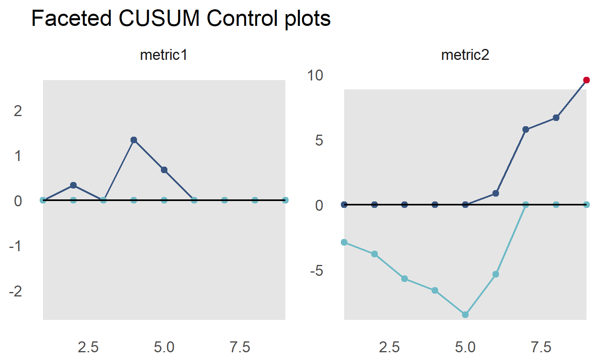
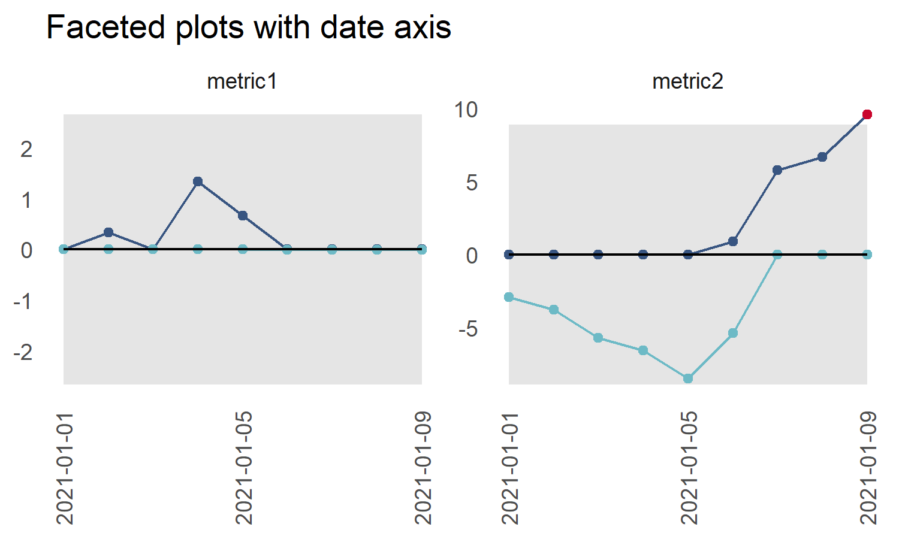

<!-- README.md is generated from README.Rmd. Please edit that file -->

# cusumcharter 

<!-- badges: start -->

[](https://github.com/johnmackintosh/cusumcharter/actions)

[](https://app.codecov.io/gh/johnmackintosh/cusumcharter?branch=master)

[](https://github.com/johnmackintosh/cusumcharter/actions/workflows/render-readme.yaml)

[](https://www.repostatus.org/#active)

[](https://CRAN.R-project.org/package=cusumcharter)
<!-- badges: end -->

The goal of cusumcharter is to create both simple CuSum charts, with and
without control limits from a vector, or to create multiple CuSum
charts, with or without control limits, from a grouped dataframe, tibble
or data.table

## Installation

Install the development version from [GitHub](https://github.com/) with:

``` r
# install.packages("remotes")
remotes::install_github("johnmackintosh/cusumcharter")
```

## A Simple CuSum calculation

This returns the CuSum statistics for a single vector, centred on a
supplied target value:

``` r
library(cusumcharter)
test_vec <- c(0.175, 0.152, 0.15, 0.207, 0.136, 0.212, 0.166)

CuSum_res <- cusum_single(test_vec, target = 0.16)
CuSum_res
#> [1] 0.175 0.167 0.157 0.204 0.180 0.232 0.238
```

## Expanded outputs with cusum\_single\_df

This function takes a single vector as input and returns a data.frame
with additional information used to calculate the CuSum statistic

``` r
test_vec2 <- c(0.175, 0.152, 0.15, 0.207, 0.136, 0.212, 0.166)
cusum_single_df(test_vec2, target = 0.16)
#>       x target     si cusumx cusum_target
#> 1 0.175   0.16  0.015  0.015        0.175
#> 2 0.152   0.16 -0.008  0.007        0.167
#> 3 0.150   0.16 -0.010 -0.003        0.157
#> 4 0.207   0.16  0.047  0.044        0.204
#> 5 0.136   0.16 -0.024  0.020        0.180
#> 6 0.212   0.16  0.052  0.072        0.232
#> 7 0.166   0.16  0.006  0.078        0.238
```

Here we don’t supply a target, so one is calculated along with the other
statistics

``` r
test_vec3 <- c(1,1,2,11,3,5,7,2,4,3,5)
cusum_single_df(test_vec3)
#>     x target si cusumx cusum_target
#> 1   1      4 -3     -3            1
#> 2   1      4 -3     -6           -2
#> 3   2      4 -2     -8           -4
#> 4  11      4  7     -1            3
#> 5   3      4 -1     -2            2
#> 6   5      4  1     -1            3
#> 7   7      4  3      2            6
#> 8   2      4 -2      0            4
#> 9   4      4  0      0            4
#> 10  3      4 -1     -1            3
#> 11  5      4  1      0            4
```

## CuSum control limits

Two additional functions allow you to calculate control limits from a
single vector and plot a CuSum chart with control limits.

``` r
test_vec3 <- c(1,1,2,3,5,7,11,7,5,7,8,9,5)
controls <- cusum_control(test_vec3, target = 4)
controls
#>     x target variance std_dev cusum      cplus      cneg cum_nplus cum_nneg
#> 1   1      4       -3 1.77305    -3  0.0000000 -2.113475         0        1
#> 2   1      4       -3 1.77305    -6  0.0000000 -4.226950         0        2
#> 3   2      4       -2 1.77305    -8  0.0000000 -5.340426         0        3
#> 4   3      4       -1 1.77305    -9  0.0000000 -5.453901         0        4
#> 5   5      4        1 1.77305    -8  0.1134752 -3.567376         1        5
#> 6   7      4        3 1.77305    -5  2.2269504  0.000000         2        0
#> 7  11      4        7 1.77305     2  8.3404255  0.000000         3        0
#> 8   7      4        3 1.77305     5 10.4539007  0.000000         4        0
#> 9   5      4        1 1.77305     6 10.5673759  0.000000         5        0
#> 10  7      4        3 1.77305     9 12.6808511  0.000000         6        0
#> 11  8      4        4 1.77305    13 15.7943262  0.000000         7        0
#> 12  9      4        5 1.77305    18 19.9078014  0.000000         8        0
#> 13  5      4        1 1.77305    19 20.0212766  0.000000         9        0
#>         ucl       lcl centre obs
#> 1  7.092199 -7.092199      0   1
#> 2  7.092199 -7.092199      0   2
#> 3  7.092199 -7.092199      0   3
#> 4  7.092199 -7.092199      0   4
#> 5  7.092199 -7.092199      0   5
#> 6  7.092199 -7.092199      0   6
#> 7  7.092199 -7.092199      0   7
#> 8  7.092199 -7.092199      0   8
#> 9  7.092199 -7.092199      0   9
#> 10 7.092199 -7.092199      0  10
#> 11 7.092199 -7.092199      0  11
#> 12 7.092199 -7.092199      0  12
#> 13 7.092199 -7.092199      0  13
```

## CuSum Control Chart

``` r
test_vec3 <- c(1,1,2,3,5,7,11,7,5,7,8,9,5)
controls <- cusum_control(test_vec3, target = 4)

cusum_control_plot(controls, 
                   xvar = obs, 
                   title_text = "CuSum out of control since 7th observation")
```


## Multiple CuSum Control Charts

Using base R to split and apply our dataset, and `data.table`’s
`rbindlist()` to combine the results into a data.frame / data.table for
plotting.

The x axis variable is the obervation number (`obs`) and the facet
variable is `.id`. Both these are generated by the `cusum_control`
function.

``` r
library(dplyr)
#> 
#> Attaching package: 'dplyr'
#> The following objects are masked from 'package:stats':
#> 
#>     filter, lag
#> The following objects are masked from 'package:base':
#> 
#>     intersect, setdiff, setequal, union
library(tibble)
#> Warning: package 'tibble' was built under R version 4.1.1
library(ggplot2)
library(cusumcharter)

testdata <- tibble::tibble(
  N = c(1L,2L,1L,3L,1L,1L,1L,1L,1L,
        1L,3L,2L,3L,2L,7L,11L,7L,9L),
  metric = c("metric1","metric1","metric1","metric1","metric1",
           "metric1","metric1","metric1","metric1","metric2",
           "metric2","metric2","metric2","metric2","metric2",
           "metric2","metric2","metric2"))

testres <- testdata %>% 
  dplyr::group_by(metric) %>% 
  dplyr::mutate(cusum_control(N)) %>% 
  dplyr::ungroup()
#> no target value supplied, so using the mean of x
#> no target value supplied, so using the mean of x

p <- cusum_control_plot(testres, 
                        xvar = obs, 
                        facet_var = metric, 
                        title_text = "Faceted CuSum Control plots")
p
```

<!-- -->

## Flexible x axis

Here we add a date column, specify that the `scale_type` is `'date'`,
and provide the `datebreaks` argument to plot our data over time

``` r
library(dplyr)
library(ggplot2)
library(cusumcharter)

testdata <- tibble::tibble(
 N = c(1L,2L,1L,3L,1L,1L,1L,1L,1L,
        1L,3L,2L,3L,2L,7L,11L,7L,9L),
  metric = c("metric1","metric1","metric1","metric1","metric1",
           "metric1","metric1","metric1","metric1","metric2",
           "metric2","metric2","metric2","metric2","metric2",
           "metric2","metric2","metric2"))

testres <- testdata %>% 
  dplyr::group_by(metric) %>% 
  dplyr::mutate(cusum_control(N)) %>% 
  dplyr::ungroup()
#> no target value supplied, so using the mean of x
#> no target value supplied, so using the mean of x

datecol <- as.Date(c("2021-01-01","2021-01-02", "2021-01-03", "2021-01-04" ,
             "2021-01-05", "2021-01-06","2021-01-07", "2021-01-08", 
             "2021-01-09"))

testres <- testres %>% 
  dplyr::group_by(metric) %>% 
  dplyr::mutate(report_date = datecol) %>% 
  ungroup

p2 <- cusum_control_plot(testres, 
                         xvar = report_date, 
                         facet_var = metric, 
                         title_text = "Faceted plots with date axis", 
                         scale_type = "date", 
                         datebreaks = '4 days')

p2 <- p2 + ggplot2::theme(axis.text.x = ggplot2::element_text(angle = 90,
                                                              hjust = 1, 
                                                              vjust = 0.5))
p2
```

<!-- -->
